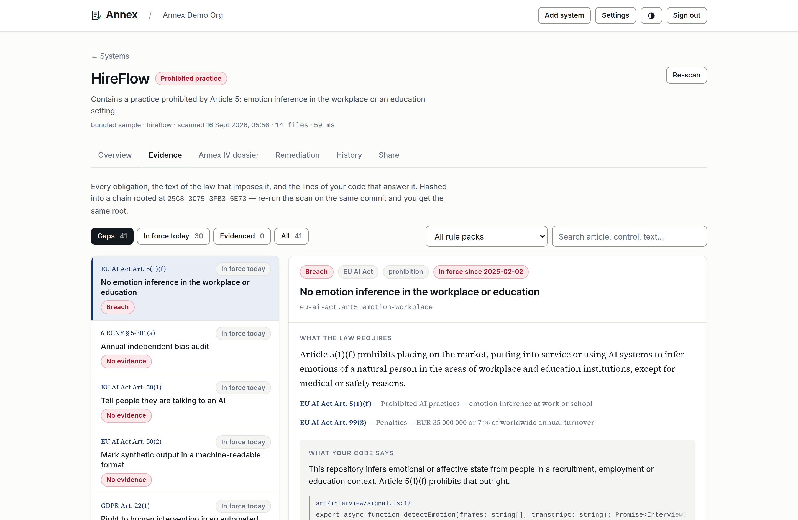
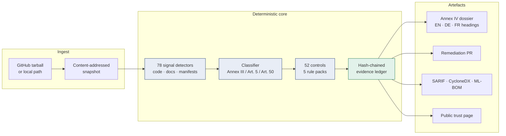

<div align="center">

# Annex

### Proof, not paperwork.

**Annex reads your codebase, decides where it falls under the EU AI Act, and proves every obligation with a file, a line and a hash.**

[Live demo](#try-it-in-two-minutes) · [How it works](#how-it-works) · [Benchmark](docs/BENCHMARK.md) · [Architecture](#architecture) · [Limitations](#limitations-and-known-issues)



</div>

---

## The problem

Every EU AI Act conformity dossier in existence is a document a company wrote about itself. Nobody has ever checked one against the system it describes.

That is not a snipe at compliance teams — it is a structural fact. The Act asks whether your system logs inference, whether a human can override it, whether you examined your data for bias. Those questions have answers, and the answers are in the repository. But the people who write the dossier cannot read the repository, and the people who can read it were never asked.

So the industry filled the gap with questionnaires. The IAPP's 2026 vendor census lists roughly ninety AI-governance vendors. Searching that document for `source code`, `static analysis`, `SAST`, `codebase` or `git repo` returns two hits, one of which is a GDPR privacy scanner and the other of which is the phrase "a U.S. codebase". No funded vendor in that census is reading the code.

Six unfunded open-source projects are — Systima Comply is the most developed, doing import, dependency, config and call-chain analysis against Articles 5, 9-15 and 50. That is the honest competitive position and it is a better one than an empty field: the mechanic is proven and nobody has claimed it. [`docs/BUSINESS.md`](docs/BUSINESS.md) names them and says what Annex does that they do not.

**And most teams believe they have until December 2027.** On 27 July 2026 the Digital Omnibus — [Regulation (EU) 2026/1744](https://artificialintelligenceact.eu/ai-act-explorer/digital-omnibus/) — pushed the Annex III high-risk deadline from August 2026 out to 2 December 2027, and the compliance industry exhaled.

It left **Article 50 exactly where it was.**

If your product talks to a person, or generates text, images, audio or video, you have been in scope since 2 August 2026, with **€15 million or 3 % of worldwide turnover** attached under Article 99(4)(g). Machine-readable marking of generated content is due **2 December 2026**. Those are not future problems.

> **Where this comes from, and how far to trust it.** The whole timing argument
> rests on one amending instrument, and the corpus was reconciled at a point
> when EUR-Lex could not be reached — so Regulation (EU) 2026/1744 was read
> through secondary sources rather than the Official Journal text. The
> underlying Regulation (EU) 2024/1689 provisions were checked against primary
> sources. Every item that could not be is marked in
> [`docs/research/`](docs/research/), which opens by saying so. If you are
> relying on the dates rather than reading about them, check the ELI before you
> do: <http://data.europa.eu/eli/reg/2024/1689/oj>.

## What Annex does

```
$ annex scan fixtures/hireflow --markets eu,us-nyc --turnover 9800000 --employees 40

 PROHIBITED  Contains a practice prohibited by Article 5: emotion inference in the workplace or an education setting.

  repository   hireflow · 14 files · 100 ms
  your role    provider and deployer (Arts. 3(3), 3(4))
  conformity   █░░░░░░░░░░░░░░░░░░░░░░░░░░░   2/100
  in force now ░░░░░░░░░░░░░░░░░░░░░░░░░░░░   1/100  20 of 20 live obligations failing
  ledger       4AA4-7D3B-BA5D-D7D7
  exposure     €20,000,000 statutory ceiling, not a forecast (GDPR Art. 83(5))
               + EU AI Act: €686,000
               + NYC Local Law 144: $500 per day of use and per missing notice, each of which is a separate violation

Classification
────────────────────────
  ✖ Emotion inference in the workplace or an education setting 89% confidence
    EU AI Act Art. 5(1)(f) Prohibited AI practices — emotion inference at work or school
    src/interview/signal.ts:17  export async function detectEmotion(frames: string[], transcript: string): Pro

  ▲ Employment: recruitment and candidate selection 97% confidence
    EU AI Act Annex III, point 4(a) High-risk AI systems — employment and worker management
    src/screening/rank.ts:28  const decision = candidateScore >= ADVANCE_THRESHOLD ? 'advance' : 'reject';

Gaps
────────────────────────

  EU AI Act 2026.09.1 · European Union
    ✖ missing   No emotion inference in the workplace or education  IN FORCE
      EU AI Act Art. 5(1)(f)
      This repository infers emotional or affective state from people in a
      recruitment, employment or education context. Article 5(1)(f) prohibits
      that outright.
      → Remove the emotion inference feature, or establish and document that the
      system is placed on the market for medical or safety reasons — the only
      carve-out in Article 5(1)(f). No amount of consent, disclosure or human
      review cures a prohibited practice.
      src/interview/signal.ts:17  export async function detectEmotion(frames: string[], transcript: stri

    ✖ missing   Tell people they are talking to an AI  IN FORCE
      EU AI Act Art. 50(1)
      This system talks directly to people and no AI disclosure was found
      anywhere in the codebase.
      → Show a persistent, clearly distinguishable notice at the start of every
      conversation stating that the user is interacting with an AI system. In
      force since 2 August 2026; exposure is EUR 15 000 000 or 3 % of worldwide
      annual turnover.

    ✖ missing   Effective human oversight while the system is in use  from 2027-12-02
```

Abridged for length — whole findings and whole gaps have been cut, but every
line shown is verbatim. The real run prints 31 gaps, each with its citation, its
evidence and its remediation. Run the command against the bundled
`fixtures/hireflow` and you get those numbers, ledger fingerprint included, with
only the timing moving.

Three things in that output are the whole product. **`src/screening/rank.ts:28`**
is a citation, not a category — you can disagree with it by opening the file.
**`in force now`** is a second score, because the Act is not one deadline.
**€686,000** is the Article 99(6) SME inversion applied to a €9.8m turnover;
without `--turnover` it shows the flat €35m cap, and the €20m headline is the
GDPR ceiling for the same failures, which Article 83 does *not* invert.


Four artefacts come out of one scan:

| Artefact | What it is for |
|---|---|
| **Evidence explorer** | Every obligation, the text of the law that imposes it, and the lines of your code that answer it |
| **Annex IV dossier** | The Article 11 technical documentation, with headings and front matter in EN/DE/FR, and every unanswerable point left explicitly open |
| **A pull request** | The files that close what code can close — additive only, and deliberately not enough to turn a control green on its own |
| **Standards exports** | SARIF for GitHub code scanning, a CycloneDX attestation (ECMA-424), an ML-BOM inventory |

## Try it in two minutes

```bash
git clone https://github.com/shi1720/LexHack.git && cd LexHack
npm install && npm run build
npm run dev          # → http://localhost:3000
```

Click **Enter the demo workspace**. No signup, no credit card, no API key. Four sample codebases are seeded and scanned on first load, including one that is illegal in the EU today and the same product after the work was done.

Or stay in the terminal:

```bash
npm run build
alias annex="node packages/cli/dist/bin.js"

annex scan fixtures/hireflow --markets eu,us-nyc --turnover 9800000 --employees 40
annex dossier fixtures/hireflow-remediated --html --out dossier.html
annex diff --base fixtures/hireflow-remediated --head fixtures/hireflow
annex scan fixtures/hireflow --format json --out report.json
annex verify report.json --against fixtures/hireflow
annex benchmark
```

`annex diff` is the one worth running twice: it detects that removing the human
oversight gate is a substantial modification under Article 3(23), which re-opens
the conformity assessment under Article 43(4).

## How it works

Annex compiles statute into executable controls. Each one carries its citation, its own application date, a detector that returns evidence, and golden fixtures that fail loudly if the detector drifts.



Five things make this different from grep with legal citations.

### 1. Domain signals fire on code, never on prose

A blog post explaining that emotion inference in hiring is prohibited is not emotion inference in hiring. Every domain detector is scoped to source files, and the benchmark contains a documentation site written specifically to catch a scanner that cannot tell the difference. Evidence is then ranked so the strongest citation surfaces first: a definition line, in a file the signal is dense in, matched by the most specific pattern — which is why the citation above lands on `rank.ts:28`, the line that actually rejects the candidate, rather than on a dependency name in `package.json`.

### 2. The law gets a test suite

A control is a function, so it can be tested:

```ts
tests: [
  {
    name: 'missing when a chat UI has no disclosure',
    files: { 'src/Chat.tsx': '…', 'src/api.ts': '…' },
    expect: 'missing',
  },
  {
    name: 'satisfied when the UI discloses',
    files: { 'src/Chat.tsx': '…<p role="status">You are chatting with an AI assistant…' },
    expect: 'satisfied',
  },
]
```

`npm test` runs every golden fixture in the corpus — 74 cases over 27 obligations, in all five packs — plus a suite that checks each EU AI Act control against a written-down Article 113 table, so a control cannot quietly sit on the wrong application date. If a regex gets greedier or a keyword gets dropped, the obligation fails here rather than silently mis-reporting somebody's conformity.

### 3. Nothing goes green because a file exists

The whole argument is that a document a company wrote about itself cannot
answer the question. So the two ways of writing exactly such a document are
closed in the engine, as an invariant over every control rather than a check
inside a few of them:

- **A scaffold is not a control.** Annex writes documentation templates with
  `_TODO_` where a human has to supply a judgement — the residual-risk
  acceptance, the declared accuracy level, the accountable person. A finding
  backed only by unfilled placeholders caps at *partial*.
- **Dead code is not a control.** Where a duty turns on code *running* —
  Article 14(4)(d)-(e) require an overseer to be able to intervene *while the
  system is in use*, Article 12(1) requires logs recorded *over the lifetime* —
  a module nothing calls caps at *partial* too. An import does not count; only
  a call site does.
- **A document answers the duty it is about.** A file qualifies because its
  name is on topic, or because the match sits under an on-topic heading. A
  README with a "Risk management" section answers Article 9; a README that
  merely says the words does not, and neither does an incident-response runbook
  that happens to contain them.

The test of all three is Annex's own remediation pull request. Applying it to
the LendWise fixture moves the score 41 → 53 — six obligations closed, and not
one of them all the way — and every control it touches says why:

```
$ annex fix . --write && annex scan . --all

  ▲ partial   Effective human oversight while the system is in use  from 2027-12-02
      EU AI Act Art. 14(1)
      All three oversight affordances were found: a human review step, an
      override path, a stop control. The code behind this finding is not reached
      from anywhere else in the repository, so it cannot be doing the work at
      the moment the obligation bites.
      → Wire it into the path that makes the decision: nothing in the repository
      reaches ai_act/human_oversight.py.

  ▲ partial   Risk management system across the lifecycle  from 2027-12-02
      EU AI Act Art. 9
      A risk register with an explicit residual-risk judgement was found. Every
      document behind this finding still carries unfilled `_TODO_` placeholders,
      so the scaffold exists but the judgements it asks for have not been made.
      → Fill in the placeholders in docs/ai-act/risk-management.md. A generated
      template is a starting point; on its own it evidences nothing.
```

Adding `from ai_act.human_oversight import gate` does not move it either. A
call does.

### 4. The evidence ledger

Every control result is reduced to a canonical line — the control, its status and score, the rule-pack version, and the SHA-256 digest of every file it cites — and hashed into a chain. The root goes on the front page of the dossier and on the public trust page.

```
$ annex verify report.json --against fixtures/hireflow

 LEDGER INTACT   D94B-458C-8507-2B4B

  48 entries re-derived from the results they describe
  root d94b458c85072b4bf5d31c62…

  Cited files, re-hashed from fixtures/hireflow
  6 file(s) checked
  ✔ every cited file still hashes to the digest in the report
```

Flip one status in that report from `missing` to `satisfied` and nothing else,
and it says so — naming the entry, and exiting 1:

```
 LEDGER BROKEN

  Entry 20 ("eu-ai-act.art5.emotion-workplace") does not hash to its
  recorded value: the status, score, rule version or cited evidence in this
  report is not what the ledger was built over.
  recomputed 4c17dcf22c804c17e7a00f12… vs recorded d94b458c85072b4bf5d31c62…
```

`annex verify report.json` re-derives every entry from the results the report describes, so an edited status no longer hashes to its recorded value. `--against <dir>` re-hashes each cited file off disk, so a report that no longer describes the tree it claims to describe says so. That is the whole difference between a document and a proof.

Being precise about what this is: a checksum chain, not a signature. There is no key and no external anchor, so anyone holding the report can recompute a self-consistent chain over different numbers. It makes a silent edit detectable by anyone who has the source. Notarisation is on the roadmap for exactly that reason.

### 5. Only a tool that reads code can detect a substantial modification

Article 3(23) defines a **substantial modification** as a change, not foreseen in the initial conformity assessment, that affects compliance with Chapter III Section 2 — and Article 43(4) then requires a *new* conformity assessment. Only something that reads the code can tell you a modification was substantial:

```
$ annex diff --base fixtures/hireflow-remediated --head fixtures/hireflow

 SUBSTANTIAL MODIFICATION  fixtures/hireflow-remediated → fixtures/hireflow

  The risk classification moved from high to prohibited. A change in the
  intended purpose is a substantial modification on the face of Article 3(23),
  and Article 43(4) then requires the conformity assessment to be re-opened
  and the technical documentation updated.

  conformity  81 → 3 (-78)
  tier        high → prohibited

  ✖ No emotion inference in the workplace or education not_applicable → missing
    eu-ai-act.art5.emotion-workplace
  ✖ Measures to support AI literacy satisfied → missing
    eu-ai-act.art4.ai-literacy
  ✖ Tell people they are talking to an AI satisfied → missing
    eu-ai-act.art50.1.interaction-disclosure
  ✖ Notify people exposed to emotion recognition or biometric categorisation not_applicable → missing
    eu-ai-act.art50.3.biometric-notification
  ✖ Determine and record whether you are the provider or the deployer satisfied → needs_review
    eu-ai-act.art3.role-determination
  ✖ Risk management system across the lifecycle satisfied → missing
    eu-ai-act.art9.risk-management
  ✖ Examine training and evaluation data for bias satisfied → missing
    eu-ai-act.art10.bias-examination
  ✖ Document data provenance and preparation satisfied → missing
    eu-ai-act.art10.data-governance
  … 29 more regressions; pass --all to list them
  ✔ Retain automatically generated logs for at least six months satisfied → not_applicable

  Article 43(4): where a high-risk AI system is substantially modified, it
  must undergo a new conformity assessment. The technical documentation is
  now out of date.
```

Both sides take a git ref or a directory, so this works in CI against
`origin/main`, and in a demo against two checked-in trees. Exit code 1 when the
modification is substantial, which is what makes it a pull-request gate.

One precision, because the product is built on not fudging these. Article 3(23)
is a **post-market** definition — a change "after its placing on the market or
putting into service" — and Article 43(4) reaches systems that have already
been through a conformity assessment. Run on a system that is neither, the diff
is not yet the Article 43(4) trigger; it is the same measurement, arriving
before the change is expensive. Annex says which of the two it is by reporting
what changed rather than asserting a legal conclusion. Recital 128 also carves
out changes the provider pre-determined and assessed at the time of the
original conformity assessment, which the diff cannot know about and does not
claim to.


A questionnaire cannot do this at all: it is answered once, by a person, about a system that then changes underneath it.

## What is in the corpus

52 executable obligations across five instruments and three jurisdictions, each reconciled against primary sources on 2026-09-15. Two of the instruments are EU law and one is a voluntary US framework, which is worth saying plainly: "five jurisdictions" would be a nicer headline and would not be true.

| Pack | Version | Obligations | Status |
|---|---|---|---|
| **EU AI Act** — Regulation (EU) 2024/1689 as amended by (EU) 2026/1744 | 2026.09.1 | 31 | Art. 5 in force since 2025-02-02, Art. 50 since 2026-08-02, Chapter III from 2027-12-02 |
| **GDPR** — automated decisions (Arts. 9, 13–17, 22, 35) | 2026.09.1 | 5 | In force since 2018 |
| **NYC Local Law 144** — AEDT bias audits, 6 RCNY §§ 5-300 to 5-304 | 2026.09.1 | 5 | Enforced since 2023-07-05 |
| **Colorado ADMT Act** — SB 26-189 | 2026.09.1 | 5 | From 2027-01-01 |
| **NIST AI RMF 1.0** — NIST AI 100-1 | 2026.09.1 | 6 | Voluntary; a statutory affirmative defence in Texas TRAIGA |

Each obligation carries its own application date, so the score splits into "conformity" and "in force today" rather than pretending the Act is one deadline. Colorado is in the corpus partly as a demonstration: SB 24-205 was preliminarily enjoined in April 2026 and repealed, and SB 26-189 replaced it. When a legislature does that, every dependent dossier goes stale — which is why packs carry a version and a reconciliation date.

Run `annex packs` to print the whole corpus, or `annex explain <control-id>` for one obligation with its citation, its detector and its fixtures.

## Accuracy

Annex is a classifier, so it owes you its error rate. The full report is in
**[docs/BENCHMARK.md](docs/BENCHMARK.md)**, generated by `npm run benchmark:report`
and never edited by hand.

| Metric | Result |
|---|---|
| Risk-tier accuracy | **100 %** (46/46) |
| Finding recall | **100 %** (23/23) |
| Carve-out precision | **100 %** (41/41) |

Roughly half the 46-case corpus exists to catch **false positives**: card-fraud
detection (expressly excluded from Annex III 5(b)), one-to-one identity
verification (excluded from 1(a)), a consumer mood-journal app (Annex III 1(c)
high-risk, *not* the Article 5(1)(f) prohibition), campaign logistics tooling
(excluded by point 8(b) because nobody is exposed to its output), invoice OCR
(Article 50(2) does not reach a system that re-expresses its input without
altering the semantics), a warehouse camera that sorts people by whether they
are wearing a hard hat (Annex III 1(b) reaches a *protected* attribute, and
personal protective equipment is not an attribute of the person), a product
recommender, and a documentation site about the AI Act.

**A clean sheet is a statement about the corpus, not about the world.** These
labels were written by the same people who wrote the detectors, which is the
standing weakness of any self-authored benchmark. Building it is still what
found the bugs: domain signals firing on prose, a missing Article 50(2) rule for
generated text, broken `go.mod` parsing, and — in the round that produced this
version — an Article 50(2) carve-out that was stated in the caveat text and
never implemented, and a domain detector that fired on a `//` comment rather
than on code — which Annex found by scanning itself and reporting itself as an
emotion-recognition system. Five cases in the corpus exist specifically to find
the edge of what static analysis can decide, including a lending decision
expressed only in SQL and a chat widget whose AI-ness may or may not be "obvious to a
reasonably well-informed" person, which is a judgement about a reader rather
than a fact about a file.

## Architecture

```
packages/engine/     No model, no framework, zero runtime dependencies.
  ingest/            Dependency-free tar reader, content-addressed snapshot
                     (the only part that touches the network, and only to
                      fetch a GitHub tarball; a local path fetches nothing)
  signals/           75 detectors over code, docs and manifests
  classify/          Rule table mapping signals → Annex III / Art. 5 / Art. 50
  packs/             The corpus: 52 controls with citations, dates, fixtures
  evaluate/          Control execution, weighted scoring, exposure modelling
  ledger/            SHA-256 hash chain + verification
  dossier/           Annex IV builder and renderers
  export/            SARIF 2.1.0, CycloneDX Attestations, ML-BOM
  benchmark/         The labelled corpus and its scorer

packages/cli/        `annex` — scan, dossier, fix, diff, verify, packs, explain, benchmark
apps/web/            Next.js 16 app: dashboard, evidence explorer, dossier, trust page
fixtures/            Four realistic sample repositories used by the demo and the tests
```

**The analysis never calls a model and never touches the network.** Fetching a GitHub tarball is the one network call in the engine, and it happens before any analysis begins; scanning a local path makes none at all. The same commit always produces the same ledger root. That is not a performance optimisation — it is the reason the output is usable as evidence, and it is why a scan of this repository runs in under half a second, offline, and a conference wifi network cannot break the demo.

A language model is used in exactly one place, and the UI labels it: rewriting an *already settled* finding for a different reader — an engineer, a founder, an assessor. It receives the decision as fact and cannot change a status, a score or a citation. With no `ANTHROPIC_API_KEY` set, that one panel explains itself and everything else is unaffected.

## Continuous conformity

```yaml
# `annex diff` resolves --base with `git archive`, so the base ref has to
# exist locally. actions/checkout defaults to a depth-1 clone, where it
# does not.
- uses: actions/checkout@v4
  with: { fetch-depth: 0 }

- name: AI Act conformity
  run: npx @annex/cli scan . --format sarif --out annex.sarif --fail-under 70

- uses: github/codeql-action/upload-sarif@v3
  with: { sarif_file: annex.sarif }

- name: Detect substantial modification
  run: npx @annex/cli diff --base origin/main --head HEAD
```

Findings land in the Security tab as code-scanning alerts, on the line that caused them. A compliance finding that lives in a PDF gets read once a year; one that lives in a diff gets fixed the same afternoon.

Annex runs this on itself — see [`.github/workflows/ci.yml`](.github/workflows/ci.yml).
Being precise about what that proves: Annex calls no model, so it is not an AI
system and only the GDPR and NIST controls bind it. The self-scan is a
regression gate on its own posture, not a demonstration of the high-risk
pipeline; the 46-case benchmark and the golden fixtures do that job. Its
`.annexignore` excludes the rule packs, the detector catalogue, the benchmark
corpus and the fixtures, for one reason stated in the file: a rule pack is
source code that quotes the practice it detects.

## What we built and what we used

Built here: the rule-pack corpus and its citations, the detector catalogue, the
classifier and its carve-outs, the scoring and exposure model, the evidence
ledger, the Annex IV builder, the remediation planner, the SARIF and CycloneDX
emitters, the drift detector, the CLI, the web application, the four fixture
repositories, and the benchmark corpus and its labels.

Off the shelf: Node 22, TypeScript, Next.js 16, React 19, Tailwind 4,
`better-sqlite3`, `jose`, Vitest, Playwright. The engine has **zero runtime
dependencies** — the tar reader, the scoring and the hash chain are all
first-party, because a compliance tool that pulls in forty transitive packages
to read a `.tar.gz` is making an argument against itself.

[`docs/research/`](docs/research/) carries the primary-source reconciliation
behind every citation, including the discovery that the timeline this project
was originally scoped against had been amended six weeks earlier.

## Limitations and known issues

- **Annex is not a conformity assessment.** It is the evidence a competent person needs in order to carry one out. It is also not legal advice, and no notified body has yet said on the record that code-grounded evidence is acceptable supporting material — which is the assumption the Conformity tier rests on, and the one thing that would most change this product's prospects if it turned out to be wrong.
- **The Article 6(3) derogation is yours to claim, not ours.** Annex evaluates the consequences of the claim and checks the one limb that is visible in code — the final subparagraph closes the derogation where the system profiles natural persons — but it will not decide for you whether a task is "narrow" in the sense the Regulation means.
- **Code presence is not conformity.** Finding `recordInference()` proves a logging call exists; it does not prove the logs are retained, queryable, or complete over the system's lifetime. Annex reports what is observable and says so. Several obligations — the Article 9(5) residual-risk acceptance, the declared accuracy level, EU database registration — are marked *open* because they are judgements or filings, not code.
- **`satisfied` means the evidence is there, not that the duty is discharged.** Annex now refuses two specific ways of faking it — a module nothing in the tree reaches, and a generated document whose `_TODO_` placeholders are unfilled, both of which cap at *partial* — but it still cannot tell you that an override is reachable by a trained, authorised person, or that a log sink is durable. On an Article 14 finding, that is exactly what an assessor will ask. Reachability analysis is the fix and it is not built.
- **Coverage is TypeScript, JavaScript and Python first.** Go, Java, Ruby, Rust, C# and PHP are detected and scanned, but the detector corpus is thinner for them.
- **Ingest caps at 4,000 files and 32 MB,** in path order. Larger repositories are scanned partially and the report carries a warning rather than pretending to completeness — but the cut is alphabetical, so on a very large monorepo the sample is arbitrary rather than representative. Prioritising by likely relevance is a known gap.
- **The benchmark is 46 cases, all written in-house.** That is enough to catch a keyword matcher and to stop a detector regressing; it is not enough to characterise behaviour on a large production monorepo, and it cannot measure what nobody thought to test.
- **One AI system rarely maps to one repository.** Under the Act the unit is the system — a service, a model, a prompt store, a feature pipeline and a UI, often across four repositories and two teams. Annex scans one tree at a time and has no way to compose a system from several. That is the next structural thing to build.
- **It can only ever serve the supply side.** Most Annex III obligation-holders — HR teams, lenders, schools, hospitals — buy their AI rather than build it, and have no repository to point at. Annex is for the people who ship the system, not the people who deploy it, and that is a ceiling on the market rather than a phase.
- **What breaks first at scale:** the per-scan cost is bounded by tree size and is already tiny, so the first thing to give is *precision on unfamiliar frameworks* — an in-house ML platform with bespoke naming will under-report. The fix is customer-authored detectors, which the rule-pack format already supports; the fix is not a bigger model.

## Commercial model

The regulation's unit of account is the AI system, not the developer, so that is
the unit Annex prices on: a free open-source tier (CLI, Action, detectors,
SARIF, classification), a team tier for the blocking PR check and drift
detection, and a per-system Conformity tier for the dossier, the attestation
bundle and evidence-freshness monitoring — anchored against a €9,900 boutique
readiness sprint and Big-4 programmes that rarely start under €75,000.

The wedge is not the compliance budget. It is the **trust page**: the artefact an
AI vendor hands a customer's security reviewer, with a ledger root the reviewer
can check. That gets Annex pulled in by sales rather than filed by legal.

The full argument, including the competitive analysis, the numbers that do not
survive checking, and a section titled "What would make me wrong", is in
[docs/BUSINESS.md](docs/BUSINESS.md).

## Documentation

| | |
|---|---|
| [docs/BENCHMARK.md](docs/BENCHMARK.md) | Accuracy, generated, including failures |
| [docs/ARCHITECTURE.md](docs/ARCHITECTURE.md) | How a scan runs, end to end |
| [docs/DEVPOST.md](docs/DEVPOST.md) | The submission write-up |
| [docs/BUSINESS.md](docs/BUSINESS.md) | Market, competition and the honest weaknesses |
| [docs/VIDEO.md](docs/VIDEO.md) | Demo script and shot list |
| [docs/research/](docs/research/) | Primary-source legal reconciliation |
| [CONTRIBUTING.md](CONTRIBUTING.md) | How to add a control or a benchmark case |
| [SECURITY.md](SECURITY.md) | Threat model, and what is not hardened yet |

## Credits

Built by **Shivam Gupta** for **LexHack 2026**, with Claude as a pair programmer. The legal corpus was reconciled against primary sources on 15 September 2026; every citation in the product links to the article it quotes.

Licensed under [Apache 2.0](LICENSE).
