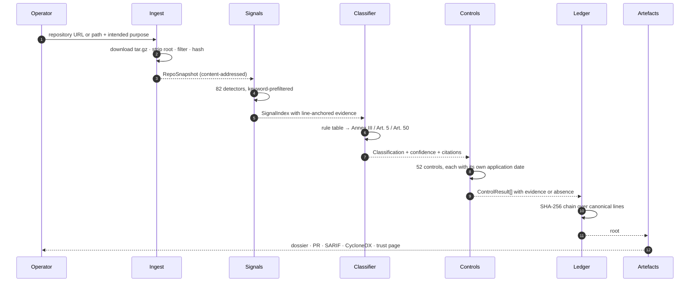

# Architecture

How one scan runs, end to end, and why each decision was made that way.

---

## The one-sentence version

A regulation is a function over a repository. Annex compiles statute into executable controls, runs them against a content-addressed snapshot of the code, and hashes the results into a chain so a third party can check the answer.

## The pipeline



Every arrow above is a pure function except the first. Nothing after ingest touches the network, and nothing at any stage calls a model.

---

## 1. Ingest — `packages/engine/src/ingest/`

A GitHub repository is fetched as a single `tar.gz` from `codeload.github.com` and read **in memory**. Nothing is cloned to disk, so a scan leaves no trace and cannot be interrupted halfway through a `git clone`.

The tar reader is **first-party and dependency-free** (`tar.ts`, ~90 lines). A compliance tool that pulls in forty transitive packages to read an archive format from 1979 is making an argument against itself.

The snapshot is **content-addressed**: its id is the SHA-256 over the sorted `(path, file-hash)` tuples. Two scans of the same tree produce the same id regardless of file ordering, and changing one byte of one file changes it.

Caps are deliberate and reported rather than silent:

| Cap | Value | Behaviour when hit |
|---|---|---|
| Files | 4,000 | `truncated: true`, surfaced as a scan warning |
| Bytes per file | 512 KB | Marked `skipped: 'too-large'`, still hashed |
| Total bytes | 32 MB | Ingest stops, warning emitted |
| Archive size | 60 MB | `IngestError` with an actionable hint |

`.annexignore` uses the useful subset of gitignore syntax including negation. Ignored files are still ingested, still hashed into the tree and **still counted in the report's warnings** — so the ledger root reflects what was actually there, and the report is honest about what it did not read.

> This file exists because Annex scanned Annex and reported Annex as containing a prohibited practice. A rule pack is source code that quotes the thing it detects: the Article 5(1)(f) control carries a golden fixture of emotion-inference code so the detector can be tested. Every regulation compiler will have this property.

## 2. Signals — `packages/engine/src/signals/`

82 detectors in eight families:

- **`ai-usage`** — which models are called, where inference happens, whether the model can invoke tools.
- **`domain`** — what the system is *for*. These drive classification, so they are the conservative ones.
- **`control` / `transparency` / `data` / `security` / `governance` / `quality`** — the positive evidence: places where the code already does what the law asks.

Two properties matter more than the detector count.

**Domain signals fire on code, never on prose.** A blog post explaining that emotion inference in hiring is prohibited is not emotion inference in hiring. Domain detectors are scoped to source languages and excluded from test, fixture and benchmark directories. The benchmark contains a documentation site written specifically to catch a scanner that cannot tell the difference.

**Evidence is ranked, not just collected.** Whoever reads a report reads the first two citations, so those two have to be the right ones. Within a file, Annex keeps the *best* matching lines rather than the first — a definition beats a usage, and imports come first in a file. Across files, the ranking is:

```
definition line  >  usage  >  documentation  >  test file  >  manifest
        then: files the signal is dense in  >  sparse mentions
        then: the most specific pattern that matched
```

That is why the Annex III 4(a) citation lands on `rank.ts:28` — `const decision = candidateScore >= ADVANCE_THRESHOLD ? 'advance' : 'reject'` — rather than on `"openai"` in `package.json`, even though both are true.

**Performance.** Each detector carries a lowercase keyword prefilter checked against the whole file before any line is scanned. Most files never reach the line loop. A 206-file repository — this one — scans in ~690 ms; the 50-case benchmark runs in ~160 ms. Both figures are re-measured by `npm run check:counts` and fail the build when the documentation drifts away from them.

## 3. Classification — `packages/engine/src/classify/`

A readable rule table, not a model. A regulator, a lawyer or a judge can audit `rules.ts` line by line, which is the entire point.

```ts
{
  id: 'annex-iii.4a.recruitment',
  tier: 'high',
  requires: ['domain.employment.screening'],
  requiresAny: ['ai.inference.call', 'ai.ml.classical', 'ai.provider.*', 'domain.automated.decision'],
  boosts: ['domain.automated.decision', 'ai.prompt.system', 'data.pii.handling'],
  baseConfidence: 0.88,
  citations: [aiActAnnex('III', '4(a)', '…', 'AI systems intended to be used for the recruitment…')],
}
```

`suppressedBy` encodes the statutory carve-outs:

- `annex-iii.1a.biometric-id` is suppressed by `domain.biometric.verification-only` — Annex III point 1(a) expressly excludes verification whose sole purpose is confirming a claimed identity.
- `gdpr.art22.automated-decision` is suppressed by `control.human.review` — Article 22 reaches decisions based *solely* on automated processing.

Confidence is derived, not asserted: base confidence, plus corroborating signals, plus evidence density, plus a small boost when the operator's stated purpose agrees. The operator's sentence can only *raise* confidence in a rule that already fired on code — a sentence in a form never creates a finding.

## 4. Controls — `packages/engine/src/packs/`

52 obligations across five instruments. A control is:

```ts
{
  id, title, obligation,           // plain English, long enough to act on
  citations,                       // instrument, pin-cite, URL, verbatim quote
  appliesFrom,                     // its own date — the Act phases in over four years
  family, severity, weight,
  appliesWhen(ctx),                // does it bind this system?
  evaluate(ctx) → satisfied | partial | missing | needs_review | not_applicable,
  remediation?,                    // files that close it
  tests?,                          // golden fixtures
}
```

**Every control carries its own application date.** The Digital Omnibus moved Annex III to 2027-12-02 and left Article 50 on 2026-08-02, so a single deadline would be a lie. The report therefore has two scores: `score` over every applicable obligation, and `liveScore` over those already in force.

**A "missing" verdict records what was searched for.** Negative findings are evidence too:

```
kind: 'absence'
snippet: 'No match for: human review, override, kill switch, feature flag'
```

**Golden fixtures give the law a test suite.** `npm test` runs every fixture in the corpus. A regex that gets greedier fails here rather than silently mis-reporting somebody's conformity.

## 5. Scoring — `packages/engine/src/evaluate/`

A weighted mean over applicable controls, with two deliberate choices:

1. **`not_applicable` is excluded, not counted as a pass.** A chatbot should not score 96 % because thirty high-risk obligations do not bind it.
2. **A breached prohibition that is in force caps the score at 25.** A system containing a prohibited practice is not "78 % compliant" — it cannot lawfully be placed on the EU market at all, and a score that says otherwise would be a lie told in a reassuring font.

**Exposure modelling** implements the actual arithmetic of Article 99, including the inversion most summaries miss: fines are normally the *higher* of a flat cap and a percentage of turnover, but Article 99(6) caps SMEs and start-ups at the *lower* of the two. Without turnover and headcount, Annex shows only the flat cap and says so — which overstates exposure for a small company by a factor of a hundred, so Settings asks for both.

## 6. The evidence ledger — `packages/engine/src/ledger/`

Each control result is reduced to a canonical line and hashed into a chain:

```
hash(n) = SHA-256( hash(n-1) ‖ controlId ‖ status ‖ score ‖ rulePackVersion ‖ evidenceDigests… )
```

Results are sorted by control id first, so the root is **order-independent and reproducible**. Each evidence digest covers the path, the line range, the SHA-256 of the file it came from, and the snippet — so changing a cited file, or changing the rule that cited it, changes the root.

`verifyLedger` checks the chain structure standalone. `verifyLedgerAgainstResults` re-derives every hash from a fresh scan and names the first entry that stopped matching:

```
Control "eu-ai-act.art14.human-oversight" no longer produces the recorded result.
The evidence it cites has changed since the dossier was issued.
```

The root, formatted as `1DB2-8665-D219-34D9`, goes on the front page of the dossier and on the public trust page.

## 7. Artefacts

| Output | Format | Why that format |
|---|---|---|
| Dossier | Annex IV structure, Markdown + print-ready HTML, EN/DE/FR | Article 11 documentation must be readable by the competent authority of the Member State concerned |
| Findings | **SARIF 2.1.0** | GitHub renders it natively in the Security tab, on the line that caused it |
| Attestation | **CycloneDX Attestations (ECMA-424)** | A standard that already expresses standard → requirement → claim → evidence → conformance, including counter-evidence. Annex did not invent a format |
| Inventory | **CycloneDX ML-BOM** | NIST AI RMF GOVERN 1.6 asks for an AI system inventory; generating it beats maintaining it |
| Remediation | Unified diff, or a real pull request via the Git data API | All files in one commit, all additive, all `createOnly` |
| Trust page | Public HTML, no source code | The artefact a customer's security reviewer actually asks for |

### Drift detection

`diffReports(before, after)` compares two scans. A regression in a Chapter III control, or a change of risk tier, is the code-visible proxy for the Article 3(23) definition of a **substantial modification** — which under Article 43(4) re-opens the conformity assessment. This is the one thing a questionnaire structurally cannot do.

---

## The application — `apps/web/`

Next.js 16 App Router, server components, server actions. No client-side state library, no data-fetching library: the server renders what the database holds, and three small client components handle the interactions that genuinely need a browser (filters, clipboard, theme).

**Storage is SQLite** via `better-sqlite3`. The product is a deterministic function of a repository, so the database only ever holds results. One file means the app runs with one command and no infrastructure, and the same schema runs on libSQL/Turso in production without a migration.

**Authentication is first-party**: scrypt for passwords, a signed JWT in an httpOnly cookie via `jose`. A compliance tool that needs you to sign up to an identity vendor before it will tell you anything is making a joke of itself — and one external service is one more thing that can be down during a demo.

**Sample systems are bundled**, so a scan works with no network and no credentials. The demo workspace seeds and scans four repositories on first load, synchronously, because each of the four sample scans takes tens of milliseconds and a reviewer should land on data rather than on four spinners.

## Where the language model is, and is not

The engine never calls a model. Classification and control evaluation are rule-based, deterministic and offline, because an auditor cannot accept "the model thought so" as evidence and a scan that depends on an API key is a scan that fails during a demo.

There is exactly one model call in the product, and the UI labels it `model-written`: rewriting an **already settled** finding for a particular reader — an engineer, a founder, an assessor. The prompt hands it the decision as fact and instructs it not to re-decide:

```
A deterministic static analysis has ALREADY decided the following.
Your job is to explain it, not to re-decide it.
Do not contradict the status. Do not invent evidence.
Do not cite an article that is not listed below.
```

With no `ANTHROPIC_API_KEY` set, that one panel explains itself and everything else is unaffected.

## What breaks first at scale

Per-scan cost is bounded by tree size and is already tiny, so throughput is not the constraint. The first thing to give is **precision on unfamiliar frameworks**: an in-house ML platform with bespoke naming will under-report, because the detectors recognise the vocabulary of the ecosystem rather than the semantics of the code. The fix is customer-authored detectors, which the rule-pack format already supports. The fix is not a bigger model — a bigger model would make the output less auditable, not more accurate.

The second is **rule-pack drift**. Colorado repealed and replaced its AI Act in May 2026; the EU amended its own timeline in July 2026. Packs therefore carry a version and a reconciliation date, both of which are hashed into the ledger, so a dossier issued against an outdated corpus can be identified as such rather than quietly trusted.
